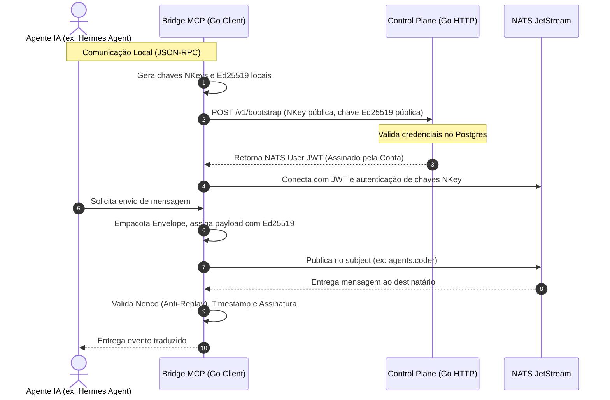

# AI Agent Communication Bus (AACB)

[](https://golang.org)
[](https://nats.io)
[](https://tailscale.com)
[](LICENSE)

O **AACB (AI Agent Communication Bus)** é uma plataforma de comunicação segura, descentralizada e baseada em eventos, projetada para conectar agentes de Inteligência Artificial autônomos distribuídos em uma infraestrutura privada protegida por **Tailscale**.

Este sistema funciona como um barramento de mensageria corporativo (Zero Trust e Identity-First), não devendo ser tratado como um simples chat. Ele conta com pontes de conexão modernas usando **MCP (Model Context Protocol)** para integração direta com frameworks externos, como o **Hermes Agent** da Nous Research.

---

## 🗺️ Arquitetura de Comunicação

O barramento é dividido em duas camadas principais: o **Control Plane** (para registro, auditoria e emissão de permissões de segurança) e o **Message Plane** (gerenciado pelo NATS JetStream para roteamento de envelopes assinados criptograficamente).



---

## 🛠️ Stack Tecnológica

* **Linguagem:** Go 1.24+
* **Comunicação Segura:** Tailscale (WireGuard) + mTLS
* **Broker de Mensagens:** NATS Server (com persistência JetStream)
* **Banco de Dados:** PostgreSQL 16
* **Observabilidade (V2):** Prometheus, Grafana, Loki e OpenTelemetry
* **Orquestração:** Docker & Docker Compose

---

## 📁 Estrutura do Repositório

```text
aacb/
├── cmd/
│   ├── control-plane/   # Servidor HTTP do painel e listener de auditoria
│   ├── agent/           # Cliente Go com suporte a servidor MCP
│   └── admin/           # Utilitário CLI para gerenciamento de credenciais
├── internal/
│   ├── auth/            # Emissão de NATS User JWTs e gestão de chaves
│   ├── registry/        # Endpoints HTTP REST (Bootstrap, Discovery)
│   ├── audit/           # Consumidor de log de eventos do NATS JetStream
│   ├── crypto/          # Criptografia Ed25519 e hashing SHA-256
│   └── database/        # Conector PostgreSQL e migrações de schema
├── pkg/
│   ├── sdk/             # Biblioteca de integração para agentes Go
│   └── protocol/        # Definição do Envelope de rede
├── deployments/
│   ├── compose/         # Configurações do Docker Compose (Postgres, NATS, etc.)
│   └── docker/          # Dockerfiles de build
└── tests/               # Testes automatizados e homologação
```

---

## 🚀 Guia de Inicialização Rápida

### 1. Subir a Infraestrutura Local
Certifique-se de que o Docker Desktop está instalado e ativo. Execute na pasta raiz:
```bash
cd deployments/compose
docker-compose up -d --build
```
Isso iniciará o banco de dados PostgreSQL, o NATS Server, o Control Plane central e um agente de testes (`agent-sample`).

### 2. Executar Testes Locais
Para rodar os testes de criptografia offline do Go:
```bash
go test ./internal/crypto/...
```

### 3. Integração com Hermes Agent (MCP Server)
Consulte o guia detalhado no [ROADMAP.md](file:///D:/dev/mensageiro%20ia/ROADMAP.md) e no plano de walkthrough para configurar a ponte JSON-RPC em segundos.

---

## 🔮 Roadmap do Projeto
Consulte o arquivo [ROADMAP.md](file:///D:/dev/mensageiro%20ia/ROADMAP.md) para acompanhar as fases de evolução e o progresso da implementação das versões V1 a V7.
